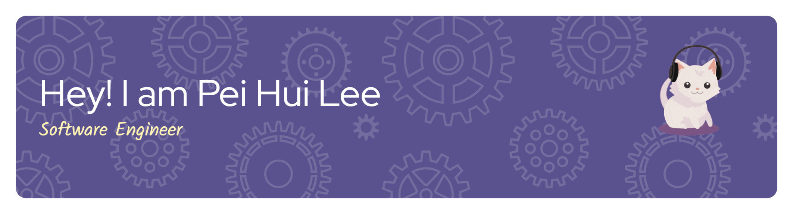

## Hi there 👋

### 💻 Final Year Software Engineering Student | Universiti Malaya

Welcome to my corner of the web! I'm a final-year undergraduate with a passion for building **robust, well-tested, and maintainable software**. My focus is on ensuring quality and reliability at every stage of the development lifecycle.

---

## 🛠️ Currently Exploring
This semester, I'm deep-diving into subjects that are crucial for high-quality enterprise systems:
* **WIF3005: Software Maintenance and Evolution** (Building systems that last)
* **WIF3006: Component-Based Software Engineering** (Designing modular and reusable components)
* **WIF3008: Real-Time Systems** (Understanding time-critical execution and reliability)

---

## 🚀 Let's Connect!

I'm always open to discussing new testing methodologies, software design patterns, or collaborative projects.

])

---

    
    

